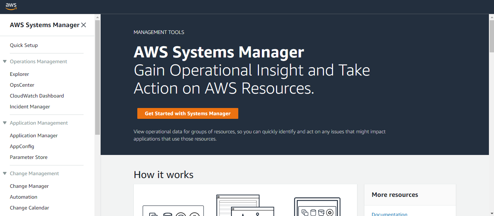
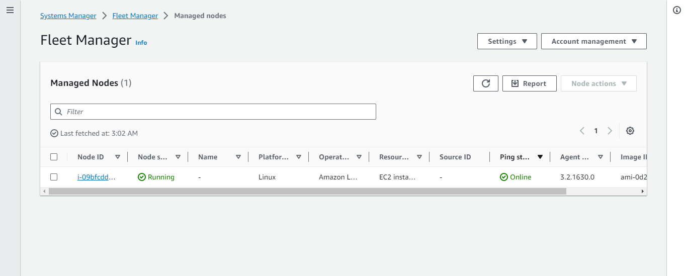
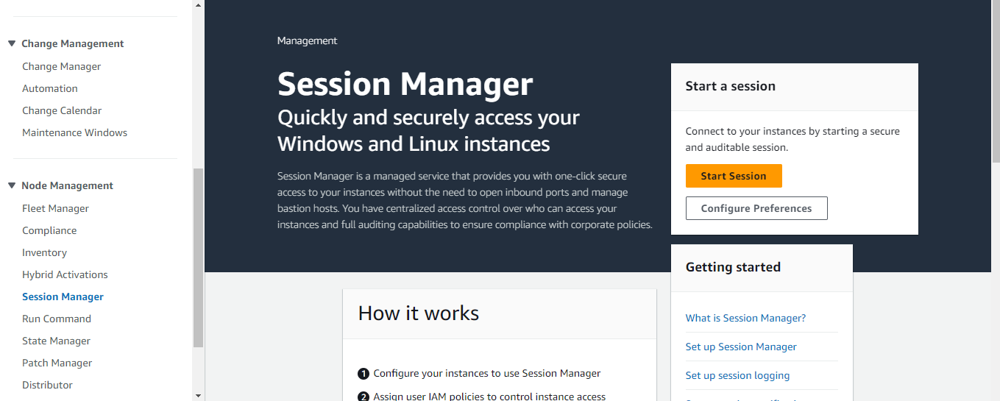
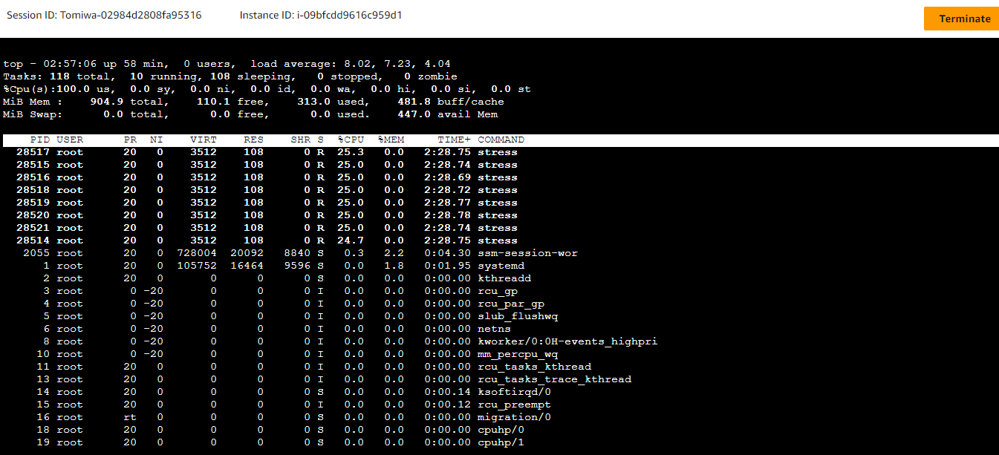
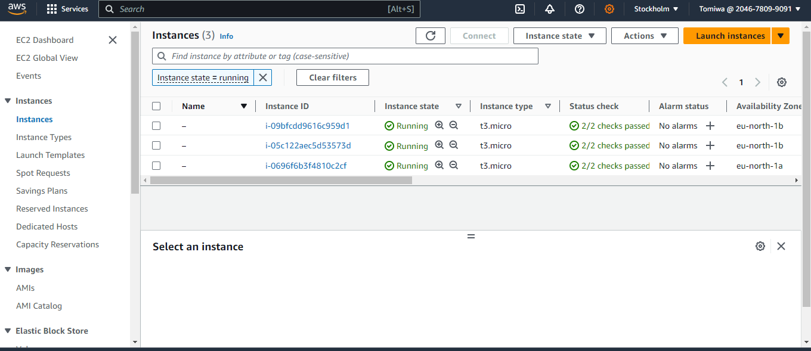
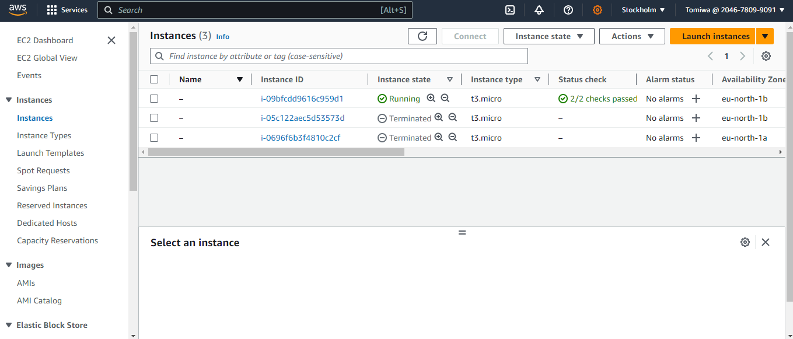

## This repository is a solution of the [Terraform Cloud Resume Challenge](https://github.com/cloudresumechallenge/projects/blob/main/projects/aws/terraform.md).

## Terraform configuration for creating an AWS EC2 Instance runnning a basic web application in Docker, supported by a Elastic Load Balancer and Auto Scaling Group.

### Go to the Remote Backend directory
```
cd s3_remote_backend
```

```
terraform init 
```

```
terraform validate
```

```
terraform plan 
```

```
terraform apply
```

### Go to Terraform Cloud Challenge directory 
```
cd terraform-cloud-challenge 
```

```
terraform init 
```

```
terraform validate
```

```
terraform plan
```

```
terraform apply
```
### Load Balancer Endpoint
- node-alb-1253122593.eu-north-1.elb.amazonaws.com

### Initiate a Scaling Event by increasing the CPU Load of the EC2 Instance using AWS Session Manager
- Go to the AWS Systems Manager via the AWS Console

- Navigate to the Fleet Manager, the Fleet Manager indicates the SSM Agent is online for the EC2 Instance which indicates the SSM Agent is ready.

- Navigate to Session Manager

- Start a session with the EC2 Instance

- Install the `stress` test tool
```
sudo yum install stress -y
```
- Initiate a scale up event in the by launching the `stress` test in the background with a cpu--8cores in 800secs
```
sudo stress --cpu 8 --timeout 800 &
```
- Autoscale EC2 Instances and alert on my device for scale up event

![picture]
- Initiate a scale down event by stopping the`stress` test
```
sudo killall stress
```
- Terminated EC2 Instances alert on my device for scale down event

![picture]

### Extras
- [Terraform Documentation on Managing AWS Auto Scaling Groups](https://developer.hashicorp.com/terraform/tutorials/aws/aws-asg).